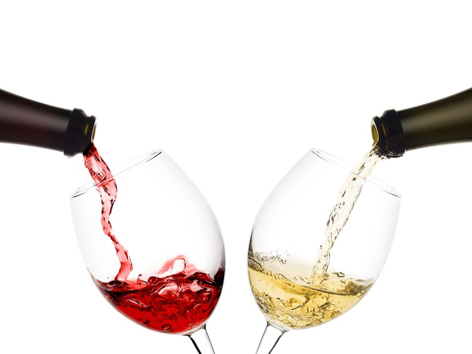

---
title: "Final Project"
author: "Scott Shang (8458655)"
date: "`r format(Sys.Date(), '%B %d, %Y')`"
output: pdf_document
---

```{r setup, include=FALSE}
library(knitr)
library(tidyverse)
library(tidymodels)
library(corrplot)
library(poissonreg)
library(corrr)
library(klaR)
library(ISLR)
library(ISLR2)
library(readr)
library(janitor)
library(glmnet)
library(rpart.plot)
library(vip)
library(vembedr)
library(ggridges)
library(discrim)
tidymodels_prefer()
# set global chunk options: images will be 7x5 inches
knitr::opts_chunk$set(fig.width=7, fig.height=5)
options(digits = 4)


## indents are for indenting r code as formatted text
## They may need to be adjusted depending on your OS
# if your output looks odd, increase or decrease indent
indent1 = '    '
indent2 = '        '
indent3 = '            '
```

## Introduction

The purpose of this project is to generate a model that will predict the quality of wine based on physicochemical tests.
<table><tr>
<td>  </td>
</tr></table>
<p align="center">
</p> 

### Wine

Since 6000 BCE, wine has been produced for thousands of years in almost every single human country. This kind of alcoholic beverage is one of the most popular drink in the world. Wine also plays an essential role in worldwide culture and religion, from Eucharist to Kiddush. Wine is typically made from fermented grapes, the process that yeast consumes the sugar in the grapes and converts it to ethanol and carbon dioxide.
```{r}
embed_youtube("7gquYRxLMFI")
```

### Why This Model Might Be Useful

For the people in the wine industry, this model can be helpful by illustrating what are the significant factors that determine the quality of wine so that they are able to improve the flavor  and predict the quality of their product. For the consumers, this model can predict the quality of specific wines so people can find the better one.

### Data Set Overview

This data set is from [Kaggle](https://www.kaggle.com/datasets/uciml/red-wine-quality-cortez-et-al-2009). The following are the key variables:

- ```fixed acidity```: The fixed acidity indicator of the wine.

- ```volatile acidity```: The amount of acetic acid in the wine.

- ```citric acid```: The amount of citric acid in the wine.

- ```residual sugar```: The amount of sugar remaining after fermentation stops.

- ```chlorides```: The amount of salt in the wine.

- ```free sulfur dioxide```: The amount of free form of SO2 exists in the wine.

- ```total sulfur dioxide```: The amount of free and bound forms of S02 in the wine.

- ```density```: The density of the wine.

- ```pH```: The pH value of the wine, describes how acidic or basic a wine is on a scale from 0 (very acidic) to 14 (very basic).

- ```sulphates```: The amount of sulphates in the wine, which can contribute to sulfur dioxide gas (S02) levels, which acts as an antimicrobial.

- ```alcohol```: The percent alcohol content of the wine.

- ```quality```: The quality of wine (score between 3 and 8).


## Exploratory Data Analysis

Read the data.
```{r}
wine <- read_csv("data/wine_quality.csv") %>% 
  clean_names()
head(wine)

wine <- wine %>% 
  mutate(quality = factor(quality))
head(wine)
```

We are interested in the 'quality' of the wine. By making a bar plot of it, we notice the distribution of 'quality' appears to be unimodal and negatively skewed. The peak is around quality of 5; the next highest is quality of 6; there is no wine rates below 3 or above 8.
```{r}
wine %>% 
  ggplot(aes(x = quality),color = 'white') +
  geom_bar()
```


Create a visualization of the correlation between all continuous predictors. We notice that free sulfur dioxide is positively correlated to total sulfur dioxide, which makes sense since total sulfur dioxide is composed by free and bounded sulfur dioxide. We also notice that fixed acidity is negatively correlated to the pH value. A reasonable explanation is that acidic solution tends to have smaller pH value.
```{r}
wine %>% 
  select(is.numeric) %>% 
  cor(use = "complete.obs") %>% 
  corrplot(method = "number", type = "lower", diag = FALSE)
```

The following graphs is a further step showing the correlation between variables. We choose the pairs of variables that are more related to each other, as shown in the last diagram, for example, 'citric acid':'fixed acidity', 'density':'alcohol', 'pH':'fixed acidity', and so on.
```{r}
graph1 <- wine %>% ggplot(aes(x = citric_acid, y = fixed_acidity)) + geom_point()
graph2 <- wine %>% ggplot(aes(x = citric_acid, y = volatile_acidity)) + geom_point()
graph3 <- wine %>% ggplot(aes(x = density, y = alcohol)) + geom_point()
graph4 <- wine %>% ggplot(aes(x = fixed_acidity, y = density)) + geom_point()
graph5 <- wine %>% ggplot(aes(x = p_h, y = fixed_acidity)) + geom_point()
graph6 <- wine %>% ggplot(aes(x = free_sulfur_dioxide, y = total_sulfur_dioxide)) + geom_point()
grid.arrange(graph1, graph2, graph3, graph4, graph5, graph6)
```

The last plot is the ridge plot. We want to investigate the relationship between the percentage alcohol of the wine and its quality. The plot splits the data set by the quality of wine, and plot their corresponding pH value. From the graph, we notice that there is a slightly possitive correlation between the pH value and the quality of the wine.
```{r}
ggplot(wine[!(wine$alcohol %in% c(0, 1)), ],aes(x=alcohol, y=quality, fill=quality)) +
  geom_density_ridges() +
  theme_ridges()
```


## Data Cleaning, Splitting, and Cross-validation

### Checking Missing Vallue

Check the summary of our data set, luckily we don't have any missing value, so we don't have to use 'mutate'.
```{r}
wine %>% 
  summary()
```


### Data Spliting

The data is split by 80% training and 20% testing with stratify our response variable 'quality'.
```{r}
set.seed(1234) # you can use any number you like
split <- wine %>% initial_split(strata = quality, 
                                           prop = 0.8)
```

Verify that the training and testing data sets have the appropriate number of observations.
```{r}
train <- training(split)
test <- testing(split)
dim(train)
dim(test)
```
### Creating Folds and Recipe

Using Cross Validation, we create a 3-fold validation, stratified by the quality of wine. We think 3-fold validation is sufficient for the model since our data set contains 1599 observations, which is a lot.
```{r}
set.seed(1234)
folds <- vfold_cv(train, strata = 'quality', 
                          v = 3)
```

```{r}
#recipe
rcp <- recipe(quality ~ . , data = wine) %>% 
  step_normalize(all_predictors())
```


## Model Building

Since the Quality of wine only takes 3, 4, 5, 6, 7, and 8, we solve this classification task by fitting the training data to the following models: support vector machine, decision tree, random forest, and boosted trees model.

### SVM

We start with the most basic classification model: the SVM model.
We run the model at levels = 3, tunning cost and degree parameters.
We notice the best model has a roc_auc of 0.7154, which is pretty high, but since SVM is a basic model, we expect the other three models can do better.
```{r}
svm_spec=svm_poly(cost = tune(), degree = tune()) %>%
  set_engine("kernlab") %>%
  set_mode("classification")
svm_wf=workflow() %>%
  add_model(svm_spec) %>%
  add_recipe(rcp)
svm_grid=grid_regular(cost(), degree(), levels=3)
svm_tune_res=svm_wf %>%
  tune_grid(resamples = folds, grid = svm_grid, metrics = metric_set(roc_auc, accuracy))

svm_best=select_best(svm_tune_res)

collect_metrics(svm_tune_res) %>% 
  arrange(-mean)
```

### Decision Tree Model

Next, we fit the data into the decision tree model, and sort out the best-performing pruned decision tress on the folds, which has a roc_auc of 0.7583. It's even more accurate than the one we got from SVM.
```{r}
#Decision Tree Model
tree_spec=decision_tree() %>%
  set_engine("rpart")

class_tree_spec=tree_spec %>%
  set_mode("classification")

class_tree_wf=workflow() %>%
  add_model(class_tree_spec %>% 
  set_args(cost_complexity = tune())) %>%
  add_recipe(rcp)

class_tree_grid=grid_regular(cost_complexity(range = c(-10, -1)), levels = 10)

class_tree_tune_res=tune_grid(
  class_tree_wf, 
  resamples=folds, 
  grid=class_tree_grid, 
  metrics=metric_set(roc_auc)
)

collect_metrics(class_tree_tune_res) %>% 
  arrange(-mean)
```

Using 'rpart.plot', we visualize our best-performing pruned decision tree with our training data set.
```{r}
class_tree_best=select_best(class_tree_tune_res)

class_tree_final=finalize_workflow(class_tree_wf,class_tree_best)

class_tree_final_fit=fit(class_tree_final,data=train)

class_tree_final_fit %>%
  extract_fit_engine() %>%
  rpart.plot()
```
### Boosted Trees Model

Next is the boosted trees model. We tune 'trees', set 'mode' to classification, and run on the 'xgboost' engine. Then, like what we did on the decision tree model, we set up the tuning grid, setting 'levels = 10', and execute the model by tunning and fitting. Lastly, we select the beset boosted tree model, which has a roc_auc of 0.7803, a little bit higher than the best decision tree model.
```{r}
#Boosted Trees
boosted_spec=boost_tree(trees=tune()) %>% 
  set_engine("xgboost") %>% 
  set_mode("classification")

boosted_wf=workflow() %>% 
  add_recipe(rcp) %>% 
  add_model(boosted_spec)

grid_boosted=grid_regular(trees(range=c(10,2000)),levels = 10)

tune_res_boosted=tune_grid(
  boosted_wf, 
  resamples=folds, 
  grid=grid_boosted, 
  metrics=metric_set(roc_auc))

boost_best=select_best(tune_res_boosted)

collect_metrics(tune_res_boosted) %>% 
  arrange(-mean)
```

### Random Forest Model

The last is the random forest model. Like what we did in the Boosted Trees model, we tune 'min_n', 'mtry', and 'trees', set 'mode' to classification, run on the 'ranger' engine, and set 'importance = "impurity"'. We gladly find that the best random forest model has the roc_auc of 0.7816, which is the highest among all the four models we have.
```{r}
#Random Forest
rf_spec=rand_forest(mtry = tune(),trees = tune(), min_n = tune()) %>%
  set_engine("ranger", importance = "impurity") %>%
  set_mode("classification")

rf_wf=workflow() %>%
  add_model(rf_spec) %>%
  add_recipe(rcp)

rf_grid=grid_regular(mtry(range=c(1,10)),trees(range=c(1,10)),min_n(range=c(1,10)),levels=10)

rf_grid

rf_tune_res=tune_grid(
  rf_wf, 
  resamples=folds, 
  grid=rf_grid, 
  metrics=metric_set(roc_auc)
)

collect_metrics(rf_tune_res) %>% 
  arrange(-mean)
```

We select the best random forest model.
Since we know the random forest model has the best model, we want to know the importance of all the predictors. Using 'vip()', fitting our best model to the training set, we find the most useful predictor is 'alcohol.
```{r}
rf_best=select_best(rf_tune_res)

rf_final=finalize_workflow(rf_wf,rf_best)

rf_final_fit=fit(rf_final,data=train)

rf_final_fit %>%
  extract_fit_engine() %>%
  vip()
```

## Model Selection and Performance

Comparing what we got in the four different models: we notice the random forest model has the greatest roc_auc and a small standard deviation error.
```{r}
best_metrics=bind_rows(svm_best,class_tree_best,rf_best,boost_best)
best_metrics=best_metrics %>% add_column('model' = c("SVM","Pruned Decision Tree","Random Forest","Boosted Tree"),'roc_auc' = c(0.7154, 0.7583, 0.7803,0.7816))
best_metrics[,c("model",".config","cost_complexity","mtry","trees","min_n","roc_auc")]
```

After selecting our the best model, we want to test the accuracy of model on the testing data set.
```{r}
best_model <- select_best(rf_tune_res, metric = "roc_auc")

final <- finalize_workflow(rf_wf, best_model)

final_fit <- fit(final, data = train)

predicted_data <- augment(final_fit, new_data = test) %>% 
  select(quality, starts_with(".pred"))
```

Calculate the 'roc_auc' of our best model on the testing set. The accuracy is great.
```{r}
predicted_data %>% roc_auc(quality, .pred_3:.pred_8)
```

Plotting the ROC curves of different quality.
```{r}
predicted_data %>% roc_curve(quality, .pred_3:.pred_8) %>% 
  autoplot()
```

Heat map of the confusion matrix. We notice that quality 5 and quality 6 have the most correct predictions, which is not surprising, because quality 5 and quality 6 have the most wine.
```{r}
predicted_data %>% 
  conf_mat(truth = quality, estimate = .pred_class) %>%
  autoplot(type = "heatmap")
```

## Conclusion

The analysis above gives us an idea about how different physicochemical factors of wine can affect the its quality.

We first go through the data set, do exploratory data analysis, including visualizations of the relationship between variables. Then we prepare the data, by cleaning, mutating missing values, splitting the data set, and creating cross-validation fold.

Then, we test various models on the training data set, including SVM, boost trees, random forest, and decision tree model. The result is random forest has the best model overall, which is not surprising to me, because random forest always had eye-catching performance in the homework and labwork before. SVM is the worst among the four models. I think the reason behind it might be SVM is too basic. I guess if we use logistic regression, it will have worse performance than the SVM.

Further research on this model can be done if more observations or more variables are introduced. While there is still much improvement to made to our model, it performance is great to me.

All in all, random forest has the best performance on our wine quality data set, and gives us a better understanding of the quality of wine.
